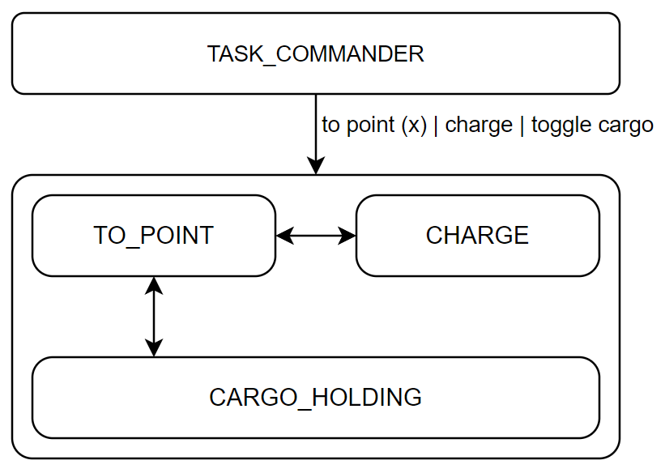
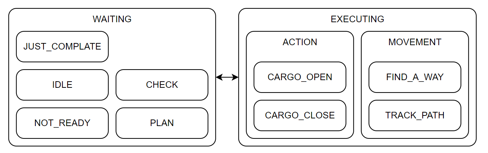

# 状态机是抽象和实现的桥梁

## 状态机

首先听 gpt 说:

> 状态机是一种抽象的模型，它描述了对象在不同状态下的行为和转换。状态机由状态、事件和转换组成，其中状态表示对象的不同状态，事件表示触发状态转换的条件，转换表示状态之间的转换关系。
> 状态机的优点在于它可以将复杂的系统分解为多个状态，每个状态只关注自己的行为和转换，从而提高了系统的可维护性和可扩展性。同时，状态机还可以实现状态的自动转换，从而减少了手动管理状态的代码量。
> 状态机的应用场景非常广泛，例如游戏开发、机器人控制、自动化测试等。在这些场景中，状态机可以帮助我们更好地管理和控制对象的状态，从而实现更加复杂和灵活的功能。
> 状态机的实现方式有多种，例如有限状态机（FSM）、状态模式、状态机框架等。不同的实现方式有不同的优缺点，开发者可以根据实际需求选择合适的实现方式。

## 状态机的实现

状态机的实现通常较为简单，1）从简而言，状态机可以通过 if-else 或 switch-case 语句实现；2）或者可以使用状态模式，即将状态封装为类，在上层通过调用状态类的方法来实现状态的转换。3）再或者，可以使用一些现有的状态机框架，例如 [autofsm](/articles/autofsm/) 或者 tinyfsm 等。

我的状态机框架没有采用多态方式，一是考虑到虚函数的调用开销，二是考虑到开发便利，采用了函数注册的方式。具体请见 [单头文件 C++ 实现一个多层状态机的库](/ariticles/autofsm/)。

## 关于抽象和实现

其实非常简单，抽象指代的是功能组件，或者说抽象逻辑，实现则是指代业务功能或者叫业务流程。
状态机在这里扮演的角色，既不是业务流程的实现者，也不单是抽象逻辑的代言者。状态机应当扮演的是两者之间的桥梁。
虽然大道理如此浅显，从程序员、到系统工程师、到产品经理，都对此有着足够的认识，但在实际项目中，还是存在许多人不愿或者难以从这个角度去思考问题。可能是时间节点卡住，可能是前期选择了简单的方式，也可能是重构成本太高（想象中太高）。

举个例子：
一个搬运机器人在卸载区域有着固定的动作，进入车间->前往等待卸载位->前往卸载位->卸载->驶出车间。
此外，它需要能够前往其他车间，或者充电区等。
一个快速的前期方案被设计为：

这种设计的好处显而易见，快速原型也是抛弃式原型，迅速搭建了一个能够满足基本需求的系统。而且看似能够很明确的搭建成一个双层状态机（第二层指的是卸载的固定动作组成一个顺序状态机）。
然而问题出现了，新需求到来，当机器人在某个车间时，它不能按照正常的卸载流程进行，而是要首先进入检验区进行检验，通过后才能前往等待卸载位。
这下，卸载状态不能满足要求，需要重新添加一个状态，可能会被称为“检验卸载”——`CHECK_AND_UNLOAD`。这个状态天生就奇怪，它与`UNLOAD`仅有一个环节的不同，却是完全另外的一个状态。它们的代码可能差别只有几行，但却要在两个文件里重复撰写和维护。
再或者，有的车间没有等待卸载位，想要不重构状态机就需要在`UNLOAD`状态中增加一个判断，判断是否需要等待，若不需要，则跳过等待卸载位这一停车点。

其实，根本问题还是出在了将抽象逻辑和业务逻辑混为一谈。并且用 fsm 实现了业务逻辑，却没有将抽象逻辑分离出来。

一个好一点的状态机可以这样设计：

相比于上一个状态机，这个系统将所有的移动行为抽象为一个状态，即`TO_POINT`，上文说过，`UNLOAD`状态中有进入车间、前往等待卸载位、前往卸载位和驶出车间这些动作，他们全部都是`TO_POINT`状态，只是参数（目标点）不同而已.
而`LOAD`和`UNLOAD`的行为则是一样的：打开货舱门，即`CARGO_HOLDING`，充电作为一个单独的状态，因为它和其他所有动作都完全不同。这样，我们的基础的抽象就出来了，即：`TO_POINT`、`CARGO_HOLDING`和`CHARGE`。
然而，抽象出来后，我们会发现，由谁来管理`TO_POINT`的参数，即目标点呢？以前可能是装载后自动进入前往工作间状态，然后前往工作间状态又自动切换到卸载状态。而现在把它们统一到`TO_POINT`之后，它怎么能自己知道自己要前往哪个点呢？

其实，它不需要自己知道，因为感知业务流程原本就不是抽象逻辑执行者的职责。业务流程自然应当由一个上层的命令下发者`COMMANDER`来完成。我们可以称之为调度模块。调度模块通过分析机器人当前所在位置、历史状态等、舱内有无货物等，来判断其应当前往哪个车间或哪个充电区，然后将这个指令下发给机器人。
这样，一个基础的抽象和实现分离，也即抽象逻辑和业务流程的分离就完成了。

当然，更进一步的，如前文所述，fsm 能做的事情并非是仅实现业务流程，也并非仅代言抽象逻辑，如果多花一些精力，它可以更好的给与业务流程反馈，也能更加精细的对抽象逻辑进行管理。

见：

将原本上层发来的指令当作一个任务，然后由 fsm 来完成这个任务，任务的状态便是状态机的状态，随时通过通信中间件反馈给上层，使其进行更好的监控和调度。向下则是更加精细的分解抽象逻辑，使他们能够各自成为一个功能组件，供上层单独进行调用，从而组合出丰富的业务功能来。

## 对开发者来说

抽象和实现的分离，使得不同方向的开发者可以专注于各自的领域，业务功能的开发者能够将抽象的功能当作一个个功能组件，正确调用组件提供的接口，合适的组合组件，就可以完成自己的业务功能。而抽象逻辑的开发者则无需考虑太多实际问题，只需要将那个输入和输出的映射实现正确即可。
对于方案设计者而言，好处也非常明显，他可以很方便的根据业务流程结合团队现状快速的提出对双方的需求和分工，并持续不断地扩展和优化这个系统。

## 抛弃式原型非要不可吗

对项目前期而言，一个抛弃式原型既可以快速搭建，也可以直接检验算法可行性，这是非常好的。只不过它的扩展性一定非常低，一定要面临重构。
我觉得，至少要经历两次抛弃式原型，一个团队的成熟架构才能真正被提炼出来，进而稳定的供给团队很长一段时间（然后再次被抛弃）。
第一次使 DEMO 时期的快速算法验证阶段，验证最底层算法能够满足项目需求。第二次是团队基于 DEMO 时期发现的一些问题，结合一些“长远的”考虑，对 DEMO 进行重构而来的新架构。
这个新架构虽然能够更加具备可扩展和可维护性，但它的根基的绝大部分来自 DEMO 期的问题，不会有太多占比属于”深思熟虑“。这种情况下，这次重构一般来说往往重构的不够彻底，但它能够稳定的投入运行，使得系统在面对真实环境中，在正常运行的大部分时间去探索那些棘手的、罕见的 corner case，从而在未来的重构中能够更好的解决。

事物是螺旋上升的，项目若足够长久，每一个原型都避免不了成为抛弃式原型，我只是觉得对于重构有排斥、畏惧是非常不可取的，这一定程度上代表了对自己当前已经做到的东西没有足够的理解和信心。当你手头上的东西已经得心应手，自然会想方设法让他们被一个优秀的框架引出更大的价值，价值发挥的更加充分。
