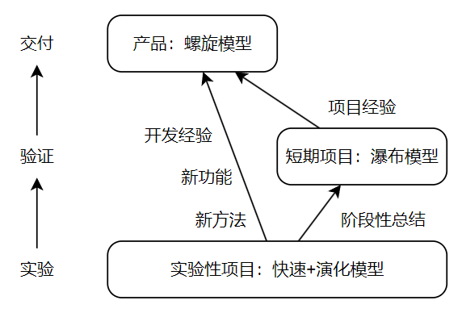
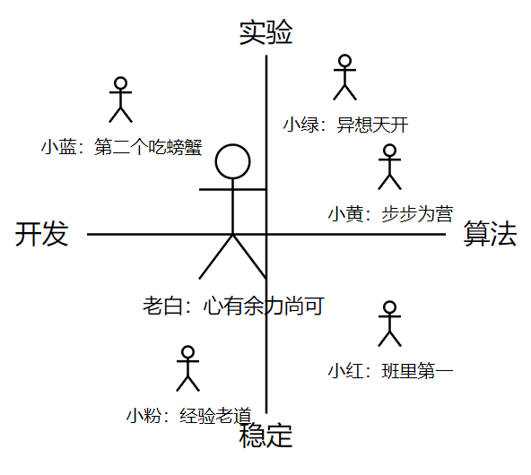

# 决策规划软件架构、团队建设与成长

## 决策规划软件架构

当前接触的决策规划架构主要还是用状态机和行为树构建一套基于规则的逻辑框架来包装和调用规划算法。以 Apollo planning 模块为例，采用简易状态机+行为树架构，插件方式组织节点，包括场景、阶段和任务，能满足大部分场景且易扩展。决策规划与其他模块最大区别在于对开发和算法能力都有要求，其他模块可视为庞大函数，是固化白盒，决策规划则是一个分层、模块化、复杂不确定的模块。

感知强调数据准确和实时，控制强调稳定和响应，其任务也都明确，注重特定功能的实现。相比之下，决策规划在自动驾驶核心位置，所有外部和内部信息几乎都要经过决策模块才能形成正确的行为，所以其强调接受信息的全面性、及时性；为提升智能化程度、保证安全，其也强调处理信息的快速性和正确性；广义的决策规划和业务逻辑直接相关，经常需要针对新需求进行或大或小的修改，所以在开发过程中也强调软件架构的兼容性和可扩展性；自动驾驶面对的环境复杂多变，所以其也强调软件的鲁棒性。由于内部模块众多，有向上面向业务的接口，有同级面向其他模块的接口，有向下面向控制的接口，其也强调模块化和解耦程度以及接口的灵活配置；对于开发者而言，其还强调开发者具备良好的系统思维，每位同学都是一位系统工程师，也强调开发者的问题解决能力，因为项目前期大部分的问题单都会汇聚到决策规划这里来。这如此多的要求是绝对高出其他模块一大截的，绝对是最具挑战性的模块，没有之一。

## 团队建设

由于决策规划模块对开发和算法能力要求都较高，但往往很少有同学能够兼顾这两个方面，即使能力能够兼顾，时间和精力上也难以真正兼顾的来。所以，决策规划其实可以简单的分为两拨人，一拨人侧重整体框架的开发，这些人 C++能力较强，注重开发规范，工具链掌握熟练。另一拨人侧重算法研发和优化，算法和数学知识掌握程度较深，数学建模能力强，注重算法创新和性能消耗。

如果是项目驱动的公司，一定要根据包括项目排期、项目需求等因素对项目适配不同的生存期模型：

1. 预计或已经进入产品化阶段的项目（产品）应当采用螺旋模型，主要输入为瀑布模型的项目经验和原型模型的开发经验，以及最重要的：新功能和新方法。
1. 短期交付项目使用瀑布模型，但开发过程中注重架构的灵活性，便于及时应对临时需求变更，主要输入为以往项目经验。
1. 实验性项目使用抛弃式原型+演化模型，作为开发经验的主要输出来源，新功能新方法的试验场。

针对这样的团队架构，则应当从另一个维度将团队至少分出两拨人，一拨人负责按部就班的开发短期项目，并维护长期项目，因为这些都是试验场下方的已有功能，仅需要简单的开发和繁琐的维护；另一拨人负责一些实验性的项目，时刻面对最新的需求、最难的问题提出最前沿的解决方案，将成果逐步下放，就像 fedora 和 redhat 那样。

看起来这么复杂，其实项目不多的话，有 4、5 个人就够了。三个开发，两个算法；一个维护，两个短期项目，两个实验项目，根据项目闲忙灵活调整。

我理想的团队，有 6 个人:

1. 老白是 TL，他支持团队的进取精神，并且以身作则，带领团队接触新鲜事物，只不过往往需要全盘考虑事物使得他不太能兼顾算法方面的新进展，但是周会上他能够快速跟进算法方面的新进展或新发现，并且提出一些建议。
1. 小粉是一位水平很高的同学，有丰富的开发和调试经验，现场的任何问题在他这里都不会花太久来解决。他注重项目的稳定推进，不太关注新特性的开发，但是，新特性或新方法和他一讲，他就能提出这些东西潜在的问题，或者把它们消化融入自己的知识储备中。
1. 小红是典型的好学生一枚，团队要求的算法他都掌握的很熟练，就是让他现推导公式他也毫不费力。他对算法的掌握使得他在技术选型阶段发挥最重要的作用，有他做技术选型和技术指导，项目可行性不必担心。
1. 小黄是个爱做实验的好孩子，他更喜欢尝试不同的方法去解决一个问题，最终总结出最好的那个办法。他不会特别激进，他讲究严谨和科学，他和小红在算法掌握上分不清孰强孰弱，有他在，团队总是在创新之路上稳步向前。
1. 小绿是个思维跳脱的同学，他总是能提出各种新颖的方案，也爱尝试，当他想出一个贼有意思的方案时，他就立马心无旁骛的钻进去，直到研究出个所以然来。相比于小黄，他不会特别注重实验的严谨性，其实，有小黄和小红在，他只需要负责经常“灵光一现”就好了。
1. 小蓝和大家都不太一样，相比于总是去面对未知难解的问题，他更喜欢将前人尝试过但他还没有尝试过的新鲜事物赶快吸收到自己的肚子里，技术大牛的博客是他最爱逛的地方，其实，他自己也早就属于技术大牛了，只不过他总是盯着世界上许许多多比他走得快的人，他还不这样觉得。

## 小组需要具备的

### 技能

1. 开发

   - **C++**

     - **14/17 新特性**：morden C++对于整个软件开发思维的提升是巨大的，在工业界的应用已经非常广泛。
     - **STL**：包括 vector/map/unordered_map/set/queue/tuple/priority_queue 等数据结构，sort/find/find_if/transform/accumulate/for_each 等算法，lambda 表达式，iterator/reverse_iterator 等迭代器，bind/function 等函数对象。
     - **shared_ptr**：包括 unique/shared/weak_ptr 等智能指针的概念、原理、用法、注意事项等。
     - **template**：基础的函数模板、类模板的撰写和使用等。
     - **macro**：理解并能使用即可。
     - **thread**：mutex/lock_guard/condition_variable 的基本原理、用法和注意事项，部分 parallel\_\*算法，如 parallel_for、parallel_transform、parallel_reduce 等，以及多线程编程相关的一些相关知识，例如线程安全、死锁问题、性能问题（锁的开销、频繁创建和销毁）以及多线程调试的复杂性。

   - **Python**

     - **数据分析**：matplotlib/numpy/pandas 等可视化或数据分析的库用以分析 log 数据。
     - **脚本撰写**：自动驾驶部分简单模块可以用 python 开发，一些工具链也可以使用 python 快速开发，例如数据采集、标注、清洗工具，算法测试工具，打包与部署工具，监控工具，仿真工具等。
     - **算法验证**：快速进行算法的验证。

   - **ROS/Cyber**

     - **ROS**： 功能包，节点，话题，服务，launch，rviz，rqt，bag，cmake，catkin_make
     - **Apollo**： 架构，组件，CyberMonitor，planning 模块，cyber_recorder， dreamview，Docker，bazel， protobuf

   - **Linux**

     - wsl
     - 常用的命令：ls, cd, mkdir, rm, cp, mv, cat, grep, find, awk, sed, tar, zip, unzip, ssh, scp, rsync, gdb, vim, emacs, git, history, top, ps, kill

   - **gdb 调试**，重点！解决 core dump 的利器

   \*\*\*\*\*\*\*\*\*\*\*\*\*\*\*\*\*\*\*\*\*\*\*\*\*\*\*\*\*\*\*\*\*\*\*\*\*\***todo: 还没写完**

1. 算法

   - 搜索
     - Dijkstra 用于图的最短路径搜索，最优解
     - A\* 启发式搜索算法，比 Dijkstra 快，局部最优
     - DP 动态规划，最优子结构和子问题重叠时，可以得到最优解
     - BFS/DFS 广度优先和深度优先，是两种思想，分别代表优先逐层扩展还是优先深入扩展
     - RRT 随机树搜索，贼快，但是只能是可行解
     - 二分查找 一种查找思想，应用于有序数组查找元素索引类型的问题，加速查找过程
     - 二叉树 一种数据结构，可以优化查找过程，例如二叉搜索树
   - 规划
     - HybridA\* 混合了 A\*算法和车辆运动学模型，用于路径规划，虽然结果可以用来循迹，但一般会加一层平滑
     - RScurve HybridA\*用的一种曲线，用于在末尾连接节点和终点，也可以用它来直接生成轨迹，由于圆弧和直线间曲率突变，所以也一般加一层平滑
     - frenet 一种以弧长和横向距离为基的坐标系，常用于表示车道线。
     - Lattice 通过在 frenet 坐标系上通过采样+生成五次多项式+评价的方式规划最优局部轨迹，可以直接用于循迹。
     - DWA 采样横纵向速度的实时规控方法，主要用于避障。
   - 算法与数据结构
     - 图 用邻接矩阵表示图，存储节点间的关系
     - 哈希 用于快速查找和插入键值对，方便存储和检索
     - 队列/栈 用于暂存数据的两种结构
     - 贪心 一种策略，在搜索的扩展环节选择下一个节点的策略，即总是做出局部最优选择，能够加快搜索速度，得到局部最优解
     - 动态规划 已述
     - 粒子群/遗传/差分进化 迭代思想的优化算法，类型特别多，因为是迭代，所以快不到哪里去，结果不具有一致性，但是对于大部分问题能够逼近全局最优
     - 二次规划 针对二次型目标函数寻找最优解，常用于轨迹规划和速度规划
     - 卡尔曼滤波 用于估计，例如自身或目标的位置、姿态、速度等
   - 设计模式
     - 策略
     - 单例
     - 状态/机
   - 数学
     - 线性代数
     - 微积分
     - 最优化
     - 控制理论
     - 车辆运动学

### 能力

- **建模能力** 清晰理解和分析问题，快速搭建解决方案框架
- **复杂问题分析能力** 准确定位，问题分解，归纳演绎，预测问题走向
- **调试能力** 包括开发过程中发现并解决问题，和实车调试过程中的协作问题，以及测试过程中的数据回灌等
- **优化能力** 代码和算法要有持续优化的过程
- **创新能力** 没有也没太大关系

### 规范

- **测试** 至少需要单元测试、集成测试和联调测试环节后，才能交予测试同学，去忙其他任务
- **代码规范** 一个团队必须有一套容易遵守的严格的编程规范
- **格式化** 代码不仅要守规，还要美观和统一
- **版本控制** 至少采用 master/release\_\[date\]/feature\_\[feat_name\]...三分支模型，根据人力选择是否采用包括 develop 和 hotfix 的五分支模型
- **代码审查** 审查人员的唯一标准：古板苛刻
- **注释规范** 简注释富文档

### 意识

- **文档意识** 个人观点警告！可以不写注释，但是文档要写的细致全面。
- **抽象意识** 要优先从抽象和实现分离的角度去思考问题，建模问题。
- **扩展意识** 在设计自己的代码框架时，就要考虑可扩展性的问题，不要用时才发现难以下手。
- **大胆重构意识** 现有的框架不足以支撑新需求，大胆重构，要对自己已经实现的东西胸有成竹，换个框架就实现不了了吗？就要出现曾经解决过的问题了吗？就会出现预测不到的问题了吗？
- **沟通意识** 不要放弃沟通，和工作有关的问题要做一个话痨，积极和合作者以及上级进行信息同步。
- **复杂度意识** 写的算法要注意复杂度，不要以实现为唯一目的。
- **测试意识** 单元测试是最需要认真对待的，有的时候，好的单元测试可以避免你在联调测试中浪费过多的时间。
- **主人公意识** 没什么好说的，利人利己。
- **自主决策权意识** 勇敢说不
- **全局意识** 从全局和基础考虑问题，从系统架构，从业务流程，从上层考虑当前环节的问题
- **安全意识** 任何代码在安全层面都不允许给出未知的结果
- **合规意识** 不知所措的时候，公司和部门规范高于一切。任何时候，法律法规高于一切。
